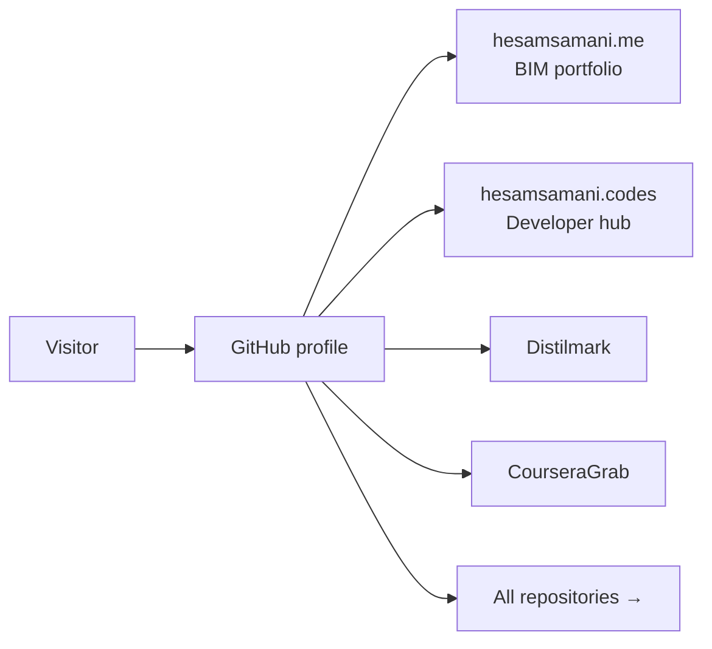

# Hesam Samani

### BIM Specialist · AI Tool Builder · Hasselt, Belgium

**4+ years Revit (Architecture, Structure, MEP) · LOD 350–400 · ISO 19650 · Python desktop apps**

 

[Who I am](#who-i-am) · [Projects](#what-im-building) · [BIM work](#bim--aec-work) · [Sites](#sites) · [Stack](#tech-stack) · [Support](#support-my-work)

---

## Who I am

I'm a BIM specialist and AI tool builder based in Hasselt, Belgium. I build **privacy-first desktop tools** and automation for AEC workflows — Revit, ISO 19650, and Python apps that work offline when they can.

Hospital & public building projects · Autodesk Certified Professional (Revit ×2, AutoCAD) · Instructor for 50+ students in Revit, AutoCAD, SketchUp & BIM best practices.

---

## What I'm building

**[Distilmark](https://github.com/Hesamsamani/Distilmark)**: an 8-engine PDF → Markdown converter. PyQt6 desktop UI, offline Ollama vision models, and optional cloud LLM backends. Privacy-first, batch conversion, Obsidian export.

**[CourseraGrab](https://github.com/Hesamsamani/CourseraGrab)**: a standalone Windows GUI to download enrolled Coursera courses — videos, subtitles, and resources for offline learning.

**[API-Meter](https://github.com/Hesamsamani/API-Meter)**: a desktop widget that tracks AI provider usage (Claude, Gemini, Cursor, Grok, Perplexity) from local sessions — no cloud dashboard.

**[DayPlanner](https://github.com/Hesamsamani/dayplanner)** *(private)*: a Structured.app-style personal day planner — visual timeline, file-based sync, hybrid AI voice planning, Mac/Windows/iOS/Android.

**[CampusFlow](https://github.com/Hesamsamani/campusflow)** *(private)*: UHasselt student companion — AI extraction of events, deadlines, and surveys from university mail on Cloudflare.

**[Coursemark](https://github.com/Hesamsamani/Coursemark)** *(private)*: turn course markdown into flashcards, quizzes, FSRS reviews, and Obsidian study hubs.

More in my [public repositories](https://github.com/Hesamsamani?tab=repositories) — desktop tools, study packs, and web apps.

---

## BIM & AEC Work

4+ years Revit across Architecture, Structure, and MEP · LOD 350–400 · ISO 19650  
Navisworks · Solibri · BIM360 · AutoCAD · Dalux · hospital & public building delivery

**[View full professional profile →](https://hesamsamani.me)**

---

## Sites

**[hesamsamani.me](https://hesamsamani.me) · [hesamsamani.codes](https://hesamsamani.codes) · [LinkedIn](https://www.linkedin.com/in/hesam-samani/)**

---

## Tech stack

| Domain | Tools |
| --- | --- |
| **BIM & AEC** | Revit · Navisworks · Solibri · BIM360 · AutoCAD · Dalux · ISO 19650 |
| **Development** | Python · PyQt6 · PyMuPDF · Ollama · FastAPI · Astro · TypeScript · Tauri · Expo · Docker · GitHub Actions |

---

## How visitors find my work

---

## Support my work

If you enjoy what I build, consider sponsoring me on [GitHub Sponsors](https://github.com/sponsors/Hesamsamani), [Ko-fi](https://ko-fi.com/hesamsamani), or [Buy Me a Coffee](https://www.buymeacoffee.com/hesamsamani):

---

  

*Based in Hasselt, Belgium · Open to relocation across Belgium & EU*

