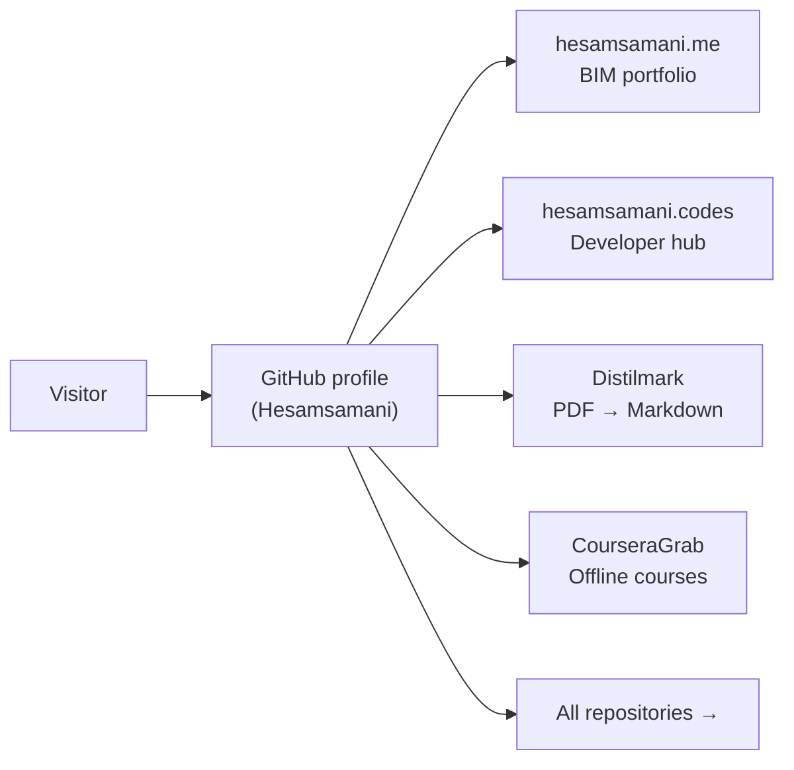

# Hesam Samani

### BIM Specialist · AI Tool Builder · Hasselt, Belgium

**4+ years Revit (Architecture, Structure, MEP) · LOD 350–400 · ISO 19650 · Python desktop apps**

 

[Professional profile](#bim--aec-work) · [Projects](#featured-projects) · [All repos](#all-repositories) · [Tech stack](#tech-stack) · [Contact](#contact)

---

## How visitors find my work

---

## BIM & AEC Work

4+ years Revit (Architecture, Structure, MEP) · LOD 350–400 · ISO 19650  
Hospital & public building projects · Autodesk Certified Professional (Revit ×2, AutoCAD)  
Instructor — 50+ students in Revit, AutoCAD, SketchUp & BIM best practices

**[View full professional profile →](https://hesamsamani.me)**

---

## Featured Projects

<table>
<tr>
<td width="50%" valign="top">

### Distilmark

**8-engine PDF → Markdown converter** with PyQt6 desktop UI, offline Ollama vision models, and hosted LLM backends (OpenAI, Anthropic, Bedrock). Privacy-first, batch conversion, Obsidian export.

**[Repository →](https://github.com/Hesamsamani/Distilmark)**

</td>
<td width="50%" valign="top">

### CourseraGrab

**Standalone Windows GUI** to download enrolled Coursera courses — videos, subtitles, and resources for offline learning. Built with PyQt5.

**[Repository →](https://github.com/Hesamsamani/CourseraGrab)**

</td>
</tr>
<tr>
<td valign="top">

### API-Meter

Desktop widget tracking **AI provider usage** (Claude, Gemini, Cursor, Grok, Perplexity) from local sessions — no cloud dashboard.

**[Repository →](https://github.com/Hesamsamani/API-Meter)**

</td>
<td valign="top">

### CampusFlow

**UHasselt student inbox companion** — AI extraction of events, deadlines, and surveys from university mail.

**[Repository →](https://github.com/Hesamsamani/campusflow)** *(private)*

</td>
</tr>
</table>

**[View all projects on hesamsamani.codes →](https://hesamsamani.codes)**

---

## All repositories

Browse the full public portfolio — desktop tools, study packs, and web apps:

**[github.com/Hesamsamani?tab=repositories](https://github.com/Hesamsamani?tab=repositories)**

| Category | Examples |
| --- | --- |
| **AI / Desktop** | Distilmark, CourseraGrab, API-Meter, Coursemark |
| **Education** | adaptive-reuse-study-pack, CourseStack |
| **Web / Portfolio** | [Hesamsamani.github.io](https://github.com/Hesamsamani/Hesamsamani.github.io), [hesamsamani-codes](https://github.com/Hesamsamani/hesamsamani-codes) |
| **Private / WIP** | campusflow, hesamjobops, hesamops-ii, uhas-companion |

---

## Tech Stack

| Domain | Tools |
| --- | --- |
| **BIM & AEC** | Revit · Navisworks · Solibri · BIM360 · AutoCAD · Dalux · ISO 19650 |
| **Development** | Python · PyQt6 · PyMuPDF · Ollama · FastAPI · Astro · TypeScript · Docker · GitHub Actions |

---

## Contact

| Channel | Link |
| --- | --- |
| Professional portfolio | [hesamsamani.me](https://hesamsamani.me) |
| Developer projects | [hesamsamani.codes](https://hesamsamani.codes) |
| LinkedIn | [linkedin.com/in/hesam-samani](https://www.linkedin.com/in/hesam-samani/) |
| GitHub | [github.com/Hesamsamani](https://github.com/Hesamsamani) |

Based in Hasselt, Belgium · Open to relocation across Belgium & EU