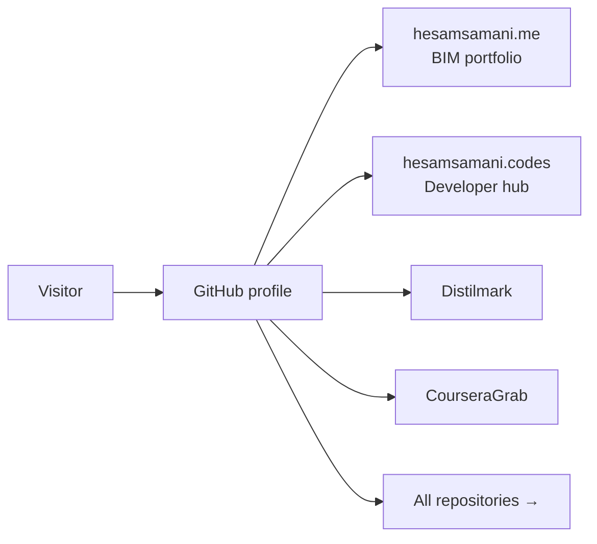

# Hesam Samani

### BIM Specialist · AI Tool Builder · Hasselt, Belgium

**4+ years Revit (Architecture, Structure, MEP) · LOD 350–400 · ISO 19650 · Python desktop apps**

 

[Who I am](#who-i-am) · [Pinned](#pinned-repositories) · [Projects](#what-im-building) · [BIM](#bim--aec-work) · [Stack](#tech-stack) · [Support](#support-my-work)

 

---

## Who I am

I'm a BIM specialist and AI tool builder based in Hasselt, Belgium. I build **privacy-first desktop tools** and automation for AEC workflows — Revit, ISO 19650, and Python apps that work offline when they can.

Hospital & public building projects · Autodesk Certified Professional (Revit ×2, AutoCAD) · Instructor for 50+ students in Revit, AutoCAD, SketchUp & BIM best practices.

---

## Pinned repositories

> Also pinned on my [GitHub profile](https://github.com/Hesamsamani) — click any card to open the repo.

<table>
<tr>
<td width="50%" valign="top">

### Distilmark

**8-engine PDF → Markdown converter** — PyQt6 desktop, offline Ollama vision, cloud LLM backends, Obsidian export.

**[Repository →](https://github.com/Hesamsamani/Distilmark)**

</td>
<td width="50%" valign="top">

### CourseraGrab

**Standalone Windows GUI** to download enrolled Coursera courses — videos, subtitles, and resources offline.

**[Repository →](https://github.com/Hesamsamani/CourseraGrab)**

</td>
</tr>
<tr>
<td valign="top">

### API-Meter

Desktop widget tracking **AI provider usage** (Claude, Gemini, Cursor, Grok, Perplexity) from local sessions.

**[Repository →](https://github.com/Hesamsamani/API-Meter)**

</td>
<td valign="top">

### hesamsamani-codes

**Developer portfolio** — projects, tools, and code. Live at [hesamsamani.codes](https://hesamsamani.codes).

**[Repository →](https://github.com/Hesamsamani/hesamsamani-codes)**

</td>
</tr>
<tr>
<td valign="top">

### Hesamsamani.github.io

**Professional BIM portfolio** — certifications, experience, and AEC project highlights.

**[Repository →](https://github.com/Hesamsamani/Hesamsamani.github.io)**

</td>
<td valign="top">

### DayPlanner

**Structured.app-style day planner** — visual timeline, file sync, hybrid AI, Glance panel, Mac/Windows/mobile.

**[Repository →](https://github.com/Hesamsamani/dayplanner)** *(private)*

</td>
</tr>
</table>

---

## What I'm building

**[Distilmark](https://github.com/Hesamsamani/Distilmark)**  — 8-engine PDF → Markdown converter. PyQt6 desktop UI, offline Ollama vision models, and optional cloud LLM backends.

**[CourseraGrab](https://github.com/Hesamsamani/CourseraGrab)**  — Standalone Windows GUI to download enrolled Coursera courses offline.

**[API-Meter](https://github.com/Hesamsamani/API-Meter)**  — Desktop widget tracking AI provider usage from local sessions.

**[DayPlanner](https://github.com/Hesamsamani/dayplanner)** *(private)* — Structured.app-style personal day planner with file-based sync and hybrid AI voice planning.

**[CampusFlow](https://github.com/Hesamsamani/campusflow)** *(private)* — UHasselt student companion with AI mail extraction on Cloudflare.

**[Coursemark](https://github.com/Hesamsamani/Coursemark)** *(private)* — Course markdown → flashcards, quizzes, FSRS reviews, Obsidian hubs.

More in my [public repositories](https://github.com/Hesamsamani?tab=repositories).

---

## BIM & AEC Work

4+ years Revit across Architecture, Structure, and MEP · LOD 350–400 · ISO 19650  
Navisworks · Solibri · BIM360 · AutoCAD · Dalux · hospital & public building delivery

**[View full professional profile →](https://hesamsamani.me)**

---

## Sites

**[hesamsamani.me](https://hesamsamani.me) · [hesamsamani.codes](https://hesamsamani.codes) · [LinkedIn](https://www.linkedin.com/in/hesam-samani/)**

---

## Tech stack

| Domain | Tools |
| --- | --- |
| **BIM & AEC** | Revit · Navisworks · Solibri · BIM360 · AutoCAD · Dalux · ISO 19650 |
| **Development** | Python · PyQt6 · PyMuPDF · Ollama · FastAPI · Astro · TypeScript · Tauri · Expo · Docker · GitHub Actions |

---

## How visitors find my work

---

## Support my work

If you enjoy what I build, consider sponsoring me on [GitHub Sponsors](https://github.com/sponsors/Hesamsamani), [Ko-fi](https://ko-fi.com/hesamsamani), or [Buy Me a Coffee](https://www.buymeacoffee.com/hesamsamani):

---

  

*Based in Hasselt, Belgium · Open to relocation across Belgium & EU*

